# Kế hoạch Phân tích Chức năng & Phân công Viết Unit Test

Tài liệu này cung cấp danh sách toàn bộ các chức năng/dịch vụ nghiệp vụ (Services) của dự án **HomeDecorShop** (kiến trúc Domain-Driven Design - DDD viết bằng .NET Core) và đề xuất phương án phân chia khối lượng công việc viết Unit Test tối ưu, cân bằng cho **4 thành viên** trong nhóm.

---

## 1. Tổng quan Kiến trúc & Các Phân hệ Chức năng

Hệ thống backend được thiết kế theo mô hình **DDD (Domain-Driven Design)** chia làm các lớp chính:
- **`HomeDecorShop.Domain`**: Chứa các thực thể (Entities), Enums định nghĩa dữ liệu cốt lõi.
- **`HomeDecorShop.Application`**: Chứa interfaces, DTOs, và đặc biệt là lớp **Services** thực thi toàn bộ logic nghiệp vụ (business logic) của hệ thống. Đây là đối tượng chính cần viết Unit Test.
- **`HomeDecorShop.API`**: Cung cấp các Controllers nhận request, xác thực JWT/Token và gọi Service tương ứng.

### Danh mục 13 Phân hệ Nghiệp vụ Chính (Application Services)

| STT | Phân hệ (Module) | Tệp tin mã nguồn chính | Số dòng code (SLOC) | Chức năng nghiệp vụ cốt lõi |
| :--- | :--- | :--- | :--- | :--- |
| **1** | **Xác thực & Phân quyền (Auth)** | `UserService.cs` | ~307 lines | Đăng ký (băm BCrypt), xác nhận Email, Đăng nhập, gia hạn Token, Quản lý trạng thái khóa tài khoản, phân quyền Role (Admin/Customer). |
| **2** | **Sổ địa chỉ (Address)** | `UserService.cs` (Address methods) | *(Trong file trên)* | Xem danh sách địa chỉ, Thêm địa chỉ mới, Cập nhật địa chỉ, Đặt địa chỉ mặc định, Xóa địa chỉ. |
| **3** | **Danh mục sản phẩm (Category)** | `CategoryService.cs` | ~147 lines | Xem, tạo mới, cập nhật, xóa danh mục. Ràng buộc logic: Tránh trùng tên/slug, không cho phép tắt kích hoạt (deactivate) danh mục khi còn sản phẩm đang bán. |
| **4** | **Danh mục sản phẩm (Product)** | `ProductService.cs` | ~446 lines | Tìm kiếm nâng cao (phân trang, lọc theo giá, thương hiệu, chất liệu, màu sắc, sắp xếp theo độ liên quan/mới nhất/giá cả), CRUD sản phẩm (Admin). |
| **5** | **Đánh giá sản phẩm (Review)** | `ProductService.cs` (Review methods) | *(Trong file trên)* | Xem đánh giá theo sản phẩm, thêm đánh giá mới, tự động tính toán lại điểm rating trung bình của sản phẩm. |
| **6** | **Giỏ hàng (Cart)** | `CartService.cs` | ~216 lines | Xem giỏ hàng hiện tại, thêm sản phẩm vào giỏ, cập nhật số lượng, xóa sản phẩm khỏi giỏ, làm trống giỏ hàng. Kiểm tra tồn kho trước khi thêm/sửa. |
| **7** | **Đơn hàng & Đặt hàng (Order)** | `OrderService.cs` | ~438 lines | Đặt hàng (Place Order) từ giỏ hàng hiện tại, giải quyết địa chỉ giao hàng mặc định, kiểm tra & giảm số lượng tồn kho vật lý, tạo mã đơn dạng `ORD-...`, dọn sạch giỏ hàng. |
| **8** | **Đổi trả & Hoàn tiền (Refund)** | `OrderService.cs` (Refund methods) | *(Trong file trên)* | Khách hàng gửi yêu cầu hoàn tiền (khiếu nại kèm lý do), Admin phê duyệt/từ chối yêu cầu hoàn tiền (nếu duyệt sẽ hoàn tiền lại vào Ví khách hàng). |
| **9** | **Cổng thanh toán (Payment)** | `PaymentService.cs` | ~374 lines | Xem lịch sử thanh toán, tạo URL thanh toán VNPay, xử lý Callback từ VNPay (kiểm tra mã giao dịch, số tiền khớp, cập nhật trạng thái đơn hàng và chuyển doanh thu sang Ví Admin). |
| **10** | **Ví điện tử (E-Wallet)** | `WalletService.cs` | ~321 lines | Xem số dư, Nạp tiền (Deposit), tạo giao dịch chờ duyệt, rút tiền (Withdraw), thanh toán đơn hàng bằng số dư ví, tự động cộng trừ tiền giữa Ví khách hàng và Ví Admin. |
| **11** | **Tiếp thị & Khuyến mãi (Marketing)** | `MarketingService.cs` | ~136 lines | Quản lý Mã giảm giá (Coupons - kiểm tra hạn sử dụng, lượt dùng tối đa), Quản lý Banner quảng cáo, Bài viết Blog. |
| **12** | **Thống kê & Dashboard (Dashboard)** | `DashboardService.cs` | ~93 lines | Thống kê doanh thu, tăng trưởng doanh thu tuần này so với tuần trước (tính %), số đơn hàng mới hôm nay, số khách hàng mới trong tháng, dữ liệu biểu đồ 7 ngày. |
| **13** | **Cấu hình & Ý kiến (Settings/Feedback)**| `SettingsService.cs`, `FeedbackService.cs` | ~133 lines | Xem/cập nhật cấu hình hệ thống, tiếp nhận ý kiến phản hồi (Feedback) của khách hàng theo CQRS Pattern. |

---

## 2. Sơ đồ Phân chia Công việc cho 4 Thành viên (Mermaid)

Để tối đa hóa tính độc lập, tránh xung đột mã nguồn (merge conflicts) và cân bằng độ khó của nghiệp vụ, các dịch vụ được gom nhóm theo mối tương quan dữ liệu và chia cho 4 nhà phát triển viết Unit Test như sau:

```mermaid
graph TD
    subgraph "PHÂN CHIA UNIT TEST"
        DevA["👤 Developer A<br><b>(Auth, Address & Settings)</b><br>Tổng SLOC: ~332 dòng"]
        DevB["👤 Developer B<br><b>(Catalog, Review & Cart)</b><br>Tổng SLOC: ~809 dòng"]
        DevC["👤 Developer C<br><b>(Order, Refund & Dashboard)</b><br>Tổng SLOC: ~639 dòng"]
        DevD["👤 Developer D<br><b>(Payment, Wallet & Marketing)</b><br>Tổng SLOC: ~831 dòng"]
    end

    %% Dev A Allocation
    DevA -->|"Test các file"| FileA1["UserService.cs (Auth/Address)"]
    DevA -->|"Test các file"| FileA2["SettingsService.cs"]

    %% Dev B Allocation
    DevB -->|"Test các file"| FileB1["ProductService.cs (Search/Review)"]
    DevB -->|"Test các file"| FileB2["CategoryService.cs"]
    DevB -->|"Test các file"| FileB3["CartService.cs"]

    %% Dev C Allocation
    DevC -->|"Test các file"| FileC1["OrderService.cs (Order/Refund)"]
    DevC -->|"Test các file"| FileC2["DashboardService.cs"]
    DevC -->|"Test các file"| FileC3["FeedbackService.cs / CQRS"]

    %% Dev D Allocation
    DevD -->|"Test các file"| FileD1["PaymentService.cs (VNPay/Process)"]
    DevD -->|"Test các file"| FileD2["WalletService.cs"]
    DevD -->|"Test các file"| FileD3["MarketingService.cs (Coupon/Banner/Blog)"]

    style DevA fill:#d4ebf2,stroke:#1a73e8,stroke-width:2px;
    style DevB fill:#fce8e6,stroke:#d93025,stroke-width:2px;
    style DevC fill:#e6f4ea,stroke:#137333,stroke-width:2px;
    style DevD fill:#fef7e0,stroke:#b06000,stroke-width:2px;
```



---

## 3. Bản phân công nhiệm vụ chi tiết từng thành viên

> [!TIP]
> Tất cả các Unit Test cần được triển khai bằng **xUnit** (đã cấu hình sẵn trong project `HomeDecorShop.Tests`) và sử dụng thư viện **Moq** để giả lập các Repositories/Services phụ thuộc mà không cần kết nối tới Database thực tế.

---

### 👤 DEVELOPER A: Xác thực, Người dùng & Cấu hình Hệ thống
*Tập trung vào tính bảo mật, các logic quản lý luồng đăng ký/đăng nhập, sđt/địa chỉ hợp lệ và thiết lập hệ thống.*

#### 📁 Các File chịu trách nhiệm chính:
1. `HomeDecorShop.Application/Services/UserService.cs` (Chức năng: Register, Login, Profile, Addresses)
2. `HomeDecorShop.Application/Services/SettingsService.cs`

#### 🎯 Các kịch bản Unit Test cốt lõi cần viết:
- **Đăng ký (`Register`):**
  - Đăng ký thành công khi dữ liệu hợp lệ (phải mã hóa mật khẩu, sinh token xác nhận).
  - Đăng ký thất bại ném lỗi `ConflictException` nếu Email đã tồn tại trong hệ thống.
- **Đăng nhập (`Login`):**
  - Đăng nhập thành công trả về AuthResult chứa Token mới khi đúng Email & Mật khẩu.
  - Trả về `null` khi nhập sai Mật khẩu hoặc Email không tồn tại.
  - Ném `RequestValidationException` khi tài khoản chưa xác nhận Email (`IsEmailConfirmed == false`).
  - Ném lỗi khi tài khoản đang bị khóa (`IsActive == false`).
- **Quản lý địa chỉ (`Addresses`):**
  - Thêm địa chỉ mới và tự động chuyển các địa chỉ cũ thành không mặc định nếu địa chỉ mới đặt `IsDefault = true`.
  - Cập nhật địa chỉ thành công / Trả về `null` nếu không tìm thấy địa chỉ.
  - Xóa địa chỉ hợp lệ / Xóa địa chỉ không tồn tại (trả về false).
- **Cấu hình hệ thống (`Settings`):**
  - Lấy cấu hình thành công (nếu db trống thì phải tự động khởi tạo mặc định).
  - Cập nhật cấu hình thành công (thay đổi UpdatedAt thành thời gian hiện tại).

#### 🔌 Các Dependency cần Mock:
- `IUserRepository`
- `IEmailService`
- `ISettingsRepository`

---

### 👤 DEVELOPER B: Danh mục, Sản phẩm, Đánh giá & Giỏ hàng
*Phân hệ này liên quan chặt chẽ tới cơ sở dữ liệu sản phẩm, thuật toán tìm kiếm/sắp xếp phức tạp và tính toán số lượng tồn kho trong giỏ hàng.*

#### 📁 Các File chịu trách nhiệm chính:
1. `HomeDecorShop.Application/Services/ProductService.cs` (Chức năng: Search, CRUD Product, Review)
2. `HomeDecorShop.Application/Services/CategoryService.cs`
3. `HomeDecorShop.Application/Services/CartService.cs`

#### 🎯 Các kịch bản Unit Test cốt lõi cần viết:
- **Tìm kiếm & Bộ lọc Sản phẩm (`Search`):**
  - Tìm kiếm theo từ khóa thô (không phân biệt hoa thường, cắt khoảng trắng).
  - Lọc sản phẩm theo khoảng giá (`MinPrice`, `MaxPrice`), lọc còn hàng (`InStockOnly`), lọc đang giảm giá (`OnSaleOnly`).
  - Sắp xếp kết quả theo các tiêu chí: `price-asc`, `price-desc`, `rating-desc`, `newest`, và độ liên quan (Relevance score).
  - Kiểm tra phân trang chính xác (đúng số lượng `Page`, `PageSize`).
- **Quản lý Danh mục (`Category`):**
  - Không cho phép tắt kích hoạt (deactivate) danh mục nếu danh mục đó vẫn chứa sản phẩm đang bán (`HasActiveProducts`).
  - Không cho phép xóa danh mục chứa bất kỳ sản phẩm nào.
  - Đảm bảo tính duy nhất của tên và slug danh mục.
- **Quản lý Giỏ hàng (`Cart`):**
  - Thêm sản phẩm vào giỏ: Ném lỗi `ConflictException` nếu sản phẩm bị ngưng hoạt động (`IsActive = false`) hoặc sản phẩm đã hết hàng.
  - Đảm bảo số lượng yêu cầu trong giỏ không vượt quá số lượng tồn kho thực tế (`EnsureStockAvailable`).
  - Cập nhật số lượng giỏ hàng/Xóa sản phẩm/Làm trống giỏ hàng thành công.

#### 🔌 Các Dependency cần Mock:
- `IProductRepository`
- `ICategoryRepository`
- `IProductReviewRepository`
- `ICartRepository`
- `IUserRepository`

---

### 👤 DEVELOPER C: Đơn đặt hàng, Đổi trả & Thống kê doanh thu
*Chịu trách nhiệm về luồng nghiệp vụ quan trọng nhất của doanh nghiệp - Thanh toán đơn hàng, trừ kho vật lý, chính sách khiếu nại hoàn tiền và dashboard báo cáo tài chính của Admin.*

#### 📁 Các File chịu trách nhiệm chính:
1. `HomeDecorShop.Application/Services/OrderService.cs` (Chức năng: PlaceOrder, Cancel, Refund)
2. `HomeDecorShop.Application/Services/DashboardService.cs`
3. `HomeDecorShop.Application/Services/FeedbackService.cs` & `Feedbacks/`

#### 🎯 Các kịch bản Unit Test cốt lõi cần viết:
- **Đặt hàng (`PlaceOrder`):**
  - Đặt hàng thành công: Tính chuẩn xác của phí ship cố định (30,000 VND), Subtotal, TotalAmount.
  - Tự động lấy địa chỉ giao hàng mặc định của user nếu input trống.
  - Giảm tồn kho sản phẩm tương ứng với số lượng đặt hàng (`DecreaseStock`).
  - Xóa sạch giỏ hàng sau khi đặt thành công.
  - Đặt hàng thất bại: Ném lỗi nếu giỏ hàng rỗng hoặc sản phẩm hết hàng giữa chừng.
- **Hủy & Hoàn tiền đơn hàng (`Cancel` / `Refund`):**
  - Hủy đơn thành công: Tự động cộng trả lại số lượng tồn kho sản phẩm (`RestoreStock`).
  - Không cho phép hủy đơn nếu đơn hàng đó đang có giao dịch VNPay chờ xử lý (`Pending`).
  - Khiếu nại hoàn tiền (`RequestRefund`): Chỉ cho phép đơn hàng trạng thái `Paid` khiếu nại.
  - Xử lý hoàn tiền (`ProcessRefund`): Nếu Admin duyệt (`approve = true`), trạng thái đơn chuyển thành `Refunded` và gọi ví điện tử để hoàn trả tiền; nếu từ chối, chuyển trạng thái về `Completed`.
- **Thống kê Dashboard (`GetStats`):**
  - Ném lỗi `ForbiddenException` nếu người gọi không phải là Admin.
  - Tính toán tăng trưởng phần trăm (%) doanh thu giữa tuần này và tuần trước chính xác (bao gồm các biên: tuần trước doanh thu = 0).
  - Lấy biểu đồ 7 ngày gần nhất khớp ngày và doanh thu thực tế.

#### 🔌 Các Dependency cần Mock:
- `IOrderRepository`
- `ICartRepository`
- `IUserRepository`
- `IProductRepository`
- `IPaymentRepository`
- `IWalletService` (Giả lập để kiểm tra luồng hoàn tiền)
- `IFeedbackRepository`

---

### 👤 DEVELOPER D: Cổng thanh toán, Ví điện tử & Tiếp thị
*Xử lý các tính năng giao dịch tài chính nhạy cảm, tích hợp thanh toán trực tuyến (VNPay), nạp/rút tiền điện tử, và các chương trình tiếp thị thu hút khách hàng.*

#### 📁 Các File chịu trách nhiệm chính:
1. `HomeDecorShop.Application/Services/PaymentService.cs` (Chức năng: VNPay URL, Callback, Process)
2. `HomeDecorShop.Application/Services/WalletService.cs` (Chức năng: Deposit, Withdraw, Wallet Pay)
3. `HomeDecorShop.Application/Services/MarketingService.cs` (Chức năng: Coupon, Banner, Blog)

#### 🎯 Các kịch bản Unit Test cốt lõi cần viết:
- **Ví điện tử (`Wallet`):**
  - Nạp tiền (`Deposit`) & Rút tiền (`Withdraw`): Số tiền nạp/rút phải lớn hơn 0; không cho phép rút vượt quá số dư ví hiện có (`InsufficientBalance`).
  - Thanh toán đơn hàng bằng ví (`PayOrder`): Trừ tiền ví khách hàng, cộng tiền ví Admin (doanh thu), tạo giao dịch lịch sử và cập nhật trạng thái đơn hàng.
  - Xử lý hoàn tiền (`ProcessRefundPayment`): Hoàn tiền từ ví Admin trả về ví Customer chuẩn xác.
- **Cổng thanh toán VNPay (`Payment`):**
  - Tạo URL thanh toán VNPay: Tránh trùng lặp mã giao dịch không an toàn.
  - Xử lý Callback (`HandleVnPayCallback`):
    - Kiểm tra số tiền nhận về khớp với số tiền đơn hàng gốc (nhân 100 theo format VNPay).
    - Cập nhật trạng thái Payment sang `Paid`, Order sang `Processing` nếu phản hồi thành công (`00`).
    - Cập nhật Payment sang `Failed` nếu phản hồi lỗi từ VNPay.
    - Chống gian lận: Kiểm tra giao dịch đã được xác nhận trước đó chưa (tránh ghi đúp trạng thái).
- **Mã giảm giá (`Coupon`):**
  - Kiểm tra tính hợp lệ của mã giảm giá: Còn hiệu lực, chưa hết lượt dùng (`MaxUsage`), đang được kích hoạt. Trả về `null` nếu mã không hợp lệ.

#### 🔌 Các Dependency cần Mock:
- `IPaymentRepository`
- `IOrderRepository`
- `IUserRepository`
- `IWalletRepository`
- `IMarketingRepository`

---

## 4. Hướng dẫn & Tiêu chuẩn viết Unit Test cho nhóm

> [!IMPORTANT]
> Để đảm bảo các Unit Test chạy đồng bộ và đạt chất lượng tốt nhất, nhóm cần tuân thủ quy tắc AAA (Arrange - Act - Assert) trong mỗi Test Case:

1. **Quy tắc đặt tên Test Case:**
   Format chuẩn: `[Tên_Phương_Thức]_[Kịch_Bản_Đầu_Vào]_[Kết_Quả_Mong_Muốn]`
   *Ví dụ:* `Login_InvalidPassword_ReturnsNull()`, `Withdraw_AmountExceedsBalance_ThrowsConflictException()`

2. **Cách cấu trúc một Test Case mẫu (sử dụng xUnit & Moq):**

```csharp
[Fact]
public void Deposit_AmountValid_ShouldIncreaseBalanceAndLogTransaction()
{
    // 1. Arrange (Chuẩn bị dữ liệu mẫu và các Mock Dependency)
    var mockWalletRepository = new Mock<IWalletRepository>();
    var mockUserRepository = new Mock<IUserRepository>();
    var mockOrderRepository = new Mock<IOrderRepository>();
    var mockPaymentRepository = new Mock<IPaymentRepository>();

    var userToken = "valid-token";
    var user = new User { UserId = 1, Email = "customer@example.com" };
    var wallet = new Wallet { Id = 10, UserId = 1, Balance = 50000m };

    mockUserRepository.Setup(repo => repo.GetByToken(userToken)).Returns(user);
    mockWalletRepository.Setup(repo => repo.GetByUserId(user.UserId)).Returns(wallet);
    mockWalletRepository.Setup(repo => repo.Update(It.IsAny<Wallet>())).Returns((Wallet w) => w);

    var walletService = new WalletService(
        mockWalletRepository.Object, 
        mockOrderRepository.Object, 
        mockPaymentRepository.Object, 
        mockUserRepository.Object
    );

    // 2. Act (Thực hiện gọi phương thức cần kiểm thử)
    var result = walletService.Deposit(userToken, 100000m);

    // 3. Assert (Kiểm chứng kết quả đầu ra và hành vi hệ thống)
    Assert.Equal(150000m, result.Balance); // Số dư cũ 50k + 100k nạp mới = 150k
    mockWalletRepository.Verify(repo => repo.Update(It.Is<Wallet>(w => w.Balance == 150000m)), Times.Once);
    mockWalletRepository.Verify(repo => repo.CreateTransaction(It.Is<WalletTransaction>(t => t.Amount == 100000m)), Times.Once);
}
```

3. **Mục tiêu độ bao phủ (Coverage Target):**
   - Đạt tối thiểu **80% Code Coverage** trên lớp Application Services.
   - Tập trung kiểm thử mọi luồng rẽ nhánh bất thường (Edge cases, Error handling, Exceptions) thay vì chỉ test luồng chạy đúng (Happy paths).
